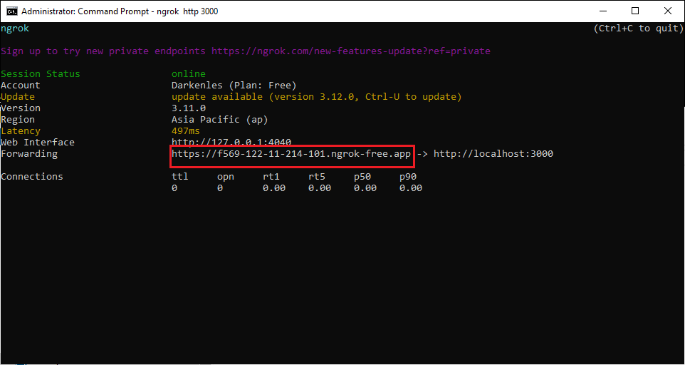
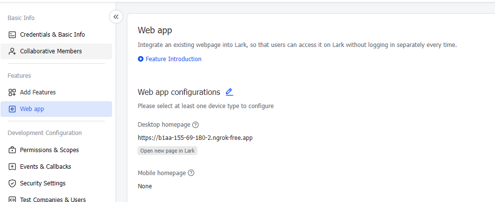

# SalesSage

SalesSage is a product developed for TikTok TechJam 2024, integrating frontend (React) and backend (Flask) technologies. The application leverages pre-trained models such as snips-nlu and whisperX for tasks including sentimental analysis, ToDo list recommendations, and Automatic Speech Recognition (ASR). Furthermore, we implemented this on lark web application to host our web application on lark messanger.

## Required Tools
1. ngrok
2. python 3.7.1
3. python 3.9
4. cuda 11.8
5. HuggingFace


## Clone this repo
Clone this repo before setting up
```bash
git clone https://github.com/Darkenles/SalesSage.git
```

## Backend Setup

### Virtual Environment 1 (Python 3.9)
**Note:** Remember to replace your HF Secret Key in 'run_whisperX.py' and 'test_whisperX.py' at the line where 'diarize_model' is being called, and subscribe to the repository provided in WhisperX for HF ([WhisperX GitHub Repo](https://github.com/m-bain/whisperX)).

### Creating Virtual Environment

Ensure Python is linked to Python version 3.9 before running the command below:

```bash
cd Backend
python -m venv venvone
venvone\Scripts\activate
```
Replace venvone with the name that your virtual environment to be called

### Setting up virtual environment to run the code
Within your git clone repo, run the following commands
```bash
mkdir uploads
mkdir model_data

pip install torch==2.0.0+cu118 torchaudio==2.0.0+cu118 -f https://download.pytorch.org/whl/torch_stable.html
pip install -r requirements.txt

git clone https://github.com/m-bain/whisperX.git
cd whisperX
pip install -e .
cd ..
```

### Running the code
After accessing your virtual environment, cd into your repo clone
```bash
python server.py
```

---

### Virtual environment 2 (Python 3.7.1)
### Creating virtual environment with CONDA
```bash
cd snips-nlu

conda create --name myenv python=3.7.1

conda activate myenv
```
Replace myenv with the desired name for your environment.
### Setting up virtual environment to run the code
Navigate to the snips-nlu folder. This is where the second flask app will be executed.
Following which run the two commands below to set up the virtual environment.
```bash
pip install -r requirements.txt

conda install --yes --file conda_requirements.txt

python -m snips_nlu download en
```
### Running the code
```bash
python App.py
```


## Frontend Setup
The version of React being used in this project is 18.0.0
### Steps to install
1. Run `npm install`
```
cd Frontend
npm install
```
2. Run `npm start` to start the app in the development mode.
```
npm start
```
The web application browser should run on your `http://localhost:3000`


## Integrating into Lark messanger
1. Create a new web app in the [Lark Developer Console](https://open.larksuite.com/)
2. Setup your ngrok and follow the instructions here [ngrok guide](https://ngrok.com/docs/guides/getting-started/)
3. Run the frontend and backend scripts
4. Setup your web application to a link using ngrok by running the follow command 
```bash
ngrok http 3000
```
5. With the link which is highlighted by the boarder as seen from this figure 
After getting the link, modify the web app configuration in ur lark developer for desktop homepage to the link.

6. After releasing the version on lark, This web application will be able to access by user through the lark messanger.

---
